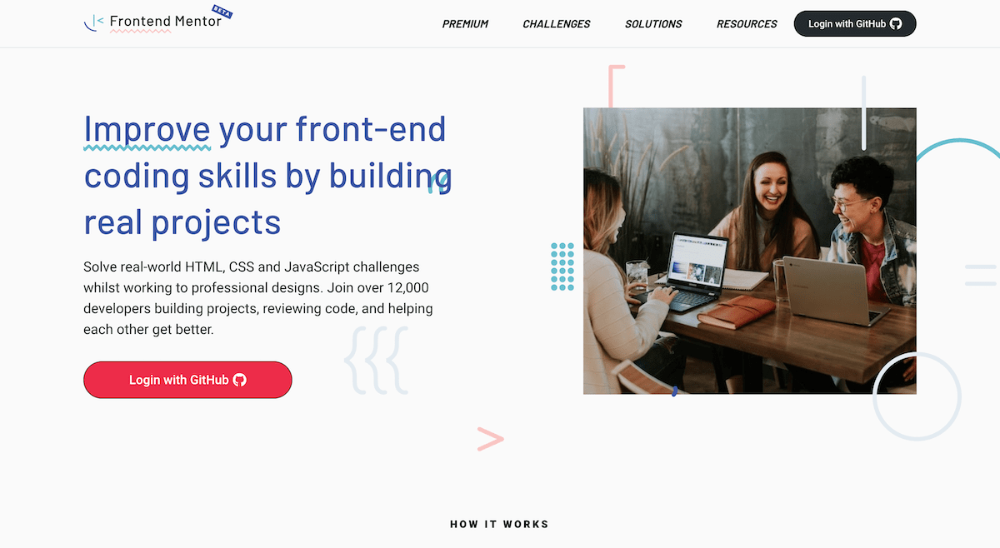

# Frontend Mentor

 

 

##### Este é um repositório criado para exibir minhas resoluções dos desafios propostos no site Frontend Mentor.

### O que é o Frontend Mentor? 
O <a  href="https://www.frontendmentor.io/" target="_blank">Frontend Mentor</a> é um site onde são disponibilizados diversos desafios de HTML, CSS e JS, onde a proposta é o usuário praticar suas habilidades com essas tecnologias. É possível encontrar desafios gratuitos em diferentes níveis, como básico, intermediário e avançado.

### Desafios Concluídos (até o momento)
#### Newbie
- <a href="https://github.com/JohnPGP/FrontEnd-Mentor/tree/main/Newbie/Recipe%20Page" target="_blank">Recipe Page</a>
- <a href="https://github.com/JohnPGP/FrontEnd-Mentor/tree/main/Newbie/Social%20Links%20Profile" target="_blank">Social Links Profile</a>
- <a href="https://github.com/JohnPGP/FrontEnd-Mentor/tree/main/Newbie/Huddle%20Landing%20Page" target="_blank">Huddle Landing Page</a>
- <a href="https://github.com/JohnPGP/FrontEnd-Mentor/tree/main/Newbie/Profile%20Card%20Component" target="_blank">Profile Card Component</a>